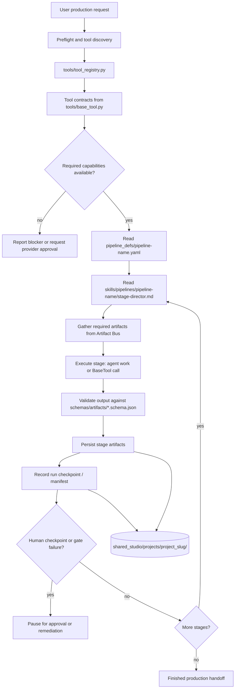
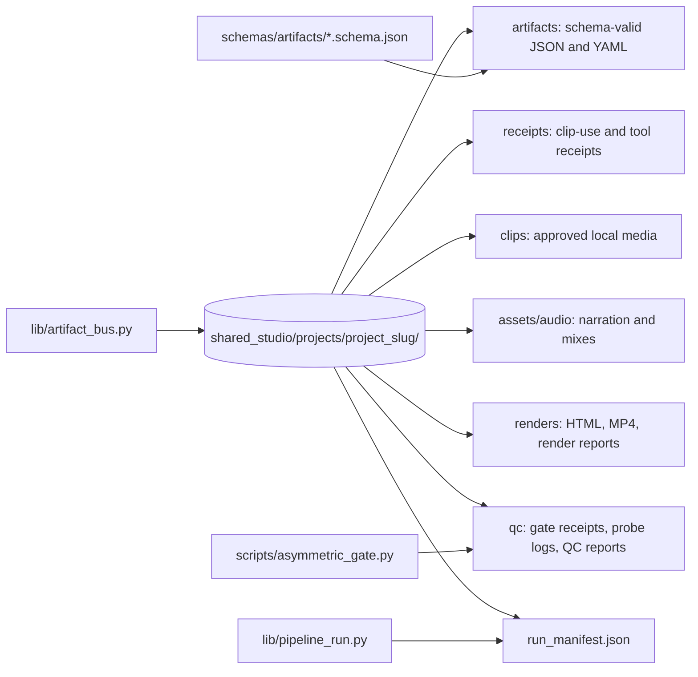
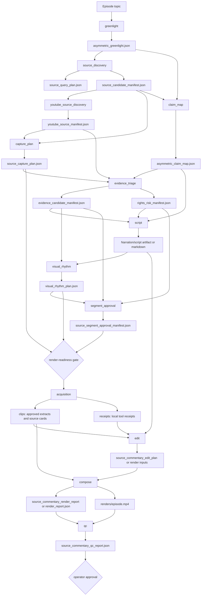
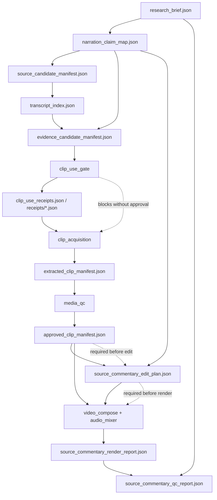
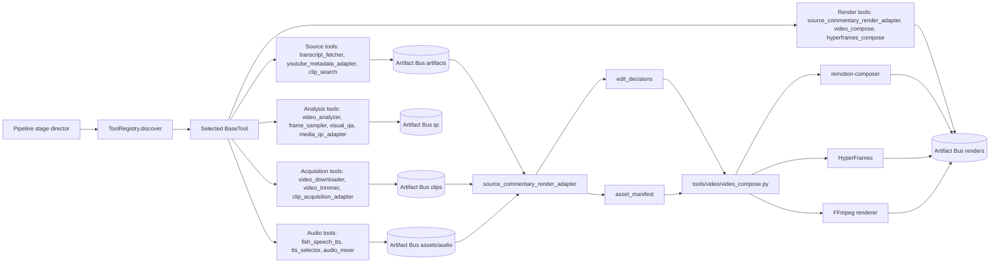
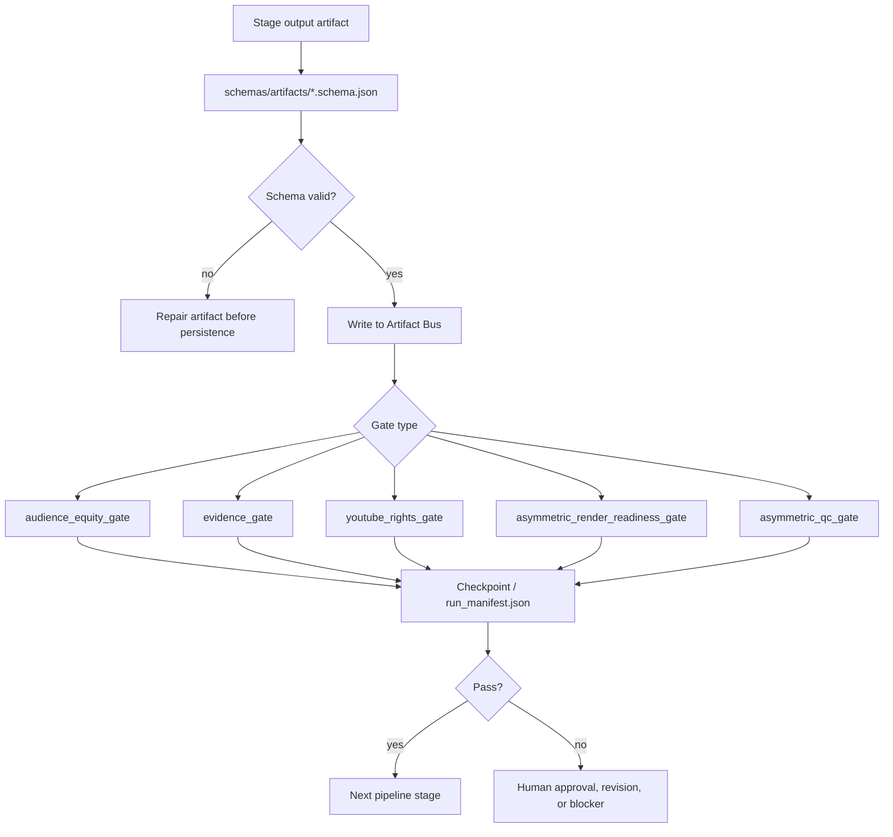

# OpenMontage Data Flow

This diagram set summarizes how data moves through this repo. OpenMontage is instruction-driven: the agent is the orchestrator, while Python modules provide tool execution, validation, persistence, and render adapters.

## Repo-Wide Production Loop

## Artifact Bus Layout

## Asymmetric Source-Commentary Pipeline

## Evidence-Locked Source-Commentary Flow

## Runtime and Tool Data Flow

## Validation and Gate Flow

## Key Source Files

- `AGENTS.md`: operating contract and Golden Loop.
- `PROJECT_CONTEXT.md`: architecture overview and repo-wide conventions.
- `pipeline_defs/`: pipeline manifests and stage contracts.
- `skills/pipelines/`: stage director instructions.
- `schemas/artifacts/`: canonical artifact schemas.
- `lib/artifact_bus.py`: project storage paths and JSON helpers.
- `lib/pipeline_contract.py`: manifest normalization and reference validation.
- `lib/pipeline_run.py`: concrete run manifest and stage recording.
- `tools/tool_registry.py`: tool discovery and capability catalog.
- `tools/base_tool.py`: shared tool contract and result shape.
- `tools/video/source_commentary_render_adapter.py`: adapts source-commentary edit plans into render contracts.
- `tools/video/video_compose.py`: runtime-aware composition orchestrator.
- `scripts/run_asymmetric_source_commentary.py`: fixture-mode Asymmetric pipeline runner.
- `scripts/asymmetric_gate.py`: render-readiness and QC gate checks.
